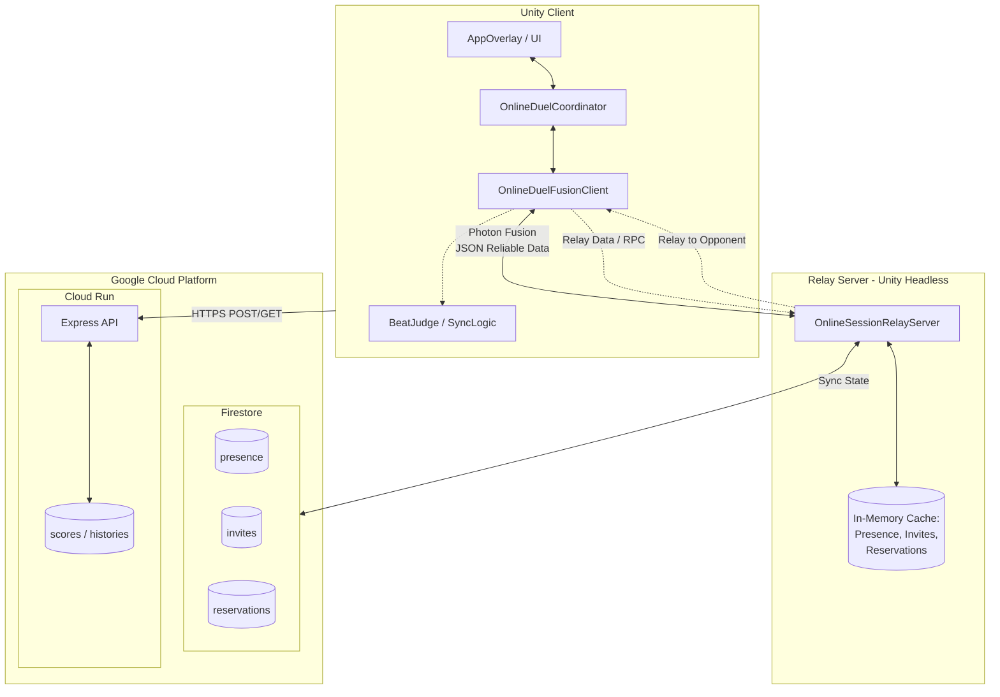

現状のオンライン機能の全体像について、調査結果に基づき設計のポイントをまとめました。

このプロジェクトのオンライン機能は、**「リアルタイムの対戦調整を行うRelay Server」と、「永続データを管理するWeb API」**、そして**「Firestoreによる状態管理」**の3つの柱で設計されています。

---

### 1. 全体アーキテクチャ図

---

### 2. 各コンポーネントの役割

#### A. Relay Server (Unity Headless / Photon Fusion)

- **役割**: 対戦の「マッチメイキング」と「リアルタイム通信の中継（リレー）」。
- **マッチングロジック**: 
  - プレイヤーの入室（Presence）を管理。
  - 「招待（Invite）→ 承認（Accept）→ 予約（Reservation）」というフローで対戦を成立させます。
  - 対戦が成立すると、ステージや使用楽曲を決定し、両クライアントに通知します。
- **通信方式**: Photon Fusionの `Reliable Data` チャンネルを使用し、JSON形式のコマンドでやり取りします。

#### B. Firestore (状態の永続化と同期)

- **役割**: プレイヤーのオンライン状態、招待状況、予約情報を管理する「共通の掲示板」。
- **設計のポイント**:
  - `presence`, `invites`, `reservations` の3つのコレクションを使用。
  - 現行インフラでは TTL（有効期限）は `reservations` のみ設定されており、`presence` / `invites` は必要時に追加できる構成です。

#### C. Web API (Cloud Run / Node.js)

- **役割**: 対戦「後」のデータ保存や、ランキングなどのWeb機能を担当。
- **主な機能**:
  - スコアの保存（`/scores`）。
  - 対戦履歴とリプレイデータの保存（`/battle-histories`）。
  - 永続的なデータの読み書きはここを経由します。

#### D. Client (Unity アプリケーション)

- **マッチング時**: `OnlineDuelFusionClient` がRelay Serverと通信し、UI（`AppOverlay`）に現在のフェーズ（待機中、招待受信中など）を反映します。
- **対戦中**: 
  - **リズム同期**: `SyncPlaybackTime` や `WaitForOnlineBeatNotificationAsync` により、ネットワーク遅延があっても両者のノーツ判定タイミングがずれないように同期されます。
  - **ポーズ管理**: 通信を維持するため、ポーズ中も `Time.timeScale` を 0 にせず、ゲームロジック側で停止させる工夫がされています。

---

### 3. オンライン対戦の成立フロー

1. **入室**: クライアントがRelay Serverに接続し、自分の存在（Presence）を通知。
2. **マッチング**:
  - 候補者リストから相手を選んで「招待」を送信。
    - 相手が「承認」すると、Firestore上に「予約（Reservation）」が作成される。
3. **対戦開始**:
  - 両者が予約を確認すると、サーバーが対戦パラメータ（ステージ等）を決定。
    - クライアントがバトルシーンへ遷移し、リズム同期を開始。

### 4. サーバコストの見積もり (100 DAU / 1日20分プレイ想定)

「1日100人が、それぞれ20分ずつプレイする」という、リリース初期の現実的な利用シーン（DAU 100）での試算です。この場合、常時接続数（平均CCU）は約1.4人と極めて低くなります。

#### A. Firestore
オンライン時間のみ課金が発生するため、コストは大幅に抑えられます。

- **Presence / Matching**:
  - 月間合計プレイ時間: 100人 × 20分 × 30日 ≒ 60,000分。
  - 書込回数: 5秒に1回更新で **月間 72万 write**。
- **概算費用**: **ほぼ $0 (無料枠内)**
  ※ Firestoreの無料枠（2万回/日 ≒ 60万回/月）をわずかに超える程度のため、課金が発生しても数十円レベルです。

#### B. Cloud Run (Web API)
- **リクエスト数**: 月間 約2万リクエスト（対戦終了時など）。
- **概算費用**: **$0 (無料枠内)**
  ※ 月間200万リクエストまで無料のため、全く費用はかかりません。

#### C. Relay Server (専用サーバー / ネットワーク転送)
ここが唯一の固定費となります。

- **計算資源 (VMインスタンス)**: 
  - プレイヤーがいない時間も接続を待機するため、24時間稼働が必要です。
  - e2-micro または e2-small インスタンスを活用。
  - **月額 $15〜$25**
- **ネットワーク転送 (Egress)**:
  - プレイ時間が限定的なため、通信量も少なくなります。
  - **月額 $5 前後**
- **概算費用**: **月額 $20〜$30**

#### D. Photon Fusion (ライセンス費用)
通信エンジンとして使用している Photon Fusion のライセンス料です。

- **100 DAU想定 (ピークCCU 20以下の場合)**:
  - **無料枠 (Free Tier)**: 20 CCUまで無料で利用可能です。
  - **費用: $0**
- **100 CCU想定**:
  - 有料プラン（100 CCUプラン ≒ **$49 / 月**）などへのアップグレードが必要です。

### 5. マッチング処理の詳細フロー（コードレベルの挙動）

`OnlineDuelFusionClient`（クライアント）と `OnlineSessionRelayServer`（サーバー）間の、Fusion Reliable Data を用いた実際のコードレベルのやり取りは以下の通り進行します。

#### 1. 入室と生存確認 (Presence)
- **Client (`NotifySceneReadyAsync`)**:
  - シーンがロードされると `OnlineDuelCommandKind.PresenceUpdate` コマンドを送信します。
- **Server (`HandleDuelCommand`)**:
  - `RegisterSession` を呼び出し、インメモリのディクショナリ `presenceBySession` にプレイヤー情報（`PlayerRef`, `SessionId`, `Scene`, `ExpiresAt: +120秒`）を登録します。
- **Discovery**:
  - `PublishCandidateFor` が実行され、他の待機中プレイヤーに対して `OnlineDuelEventKind.CandidateShown` イベントを送信。クライアントのUIに相手が表示されます。

#### 2. 招待 (Invitation)
- **Client (`InviteCandidate`)**:
  - UIで相手を選ぶと `OnlineDuelCommandKind.InviteCreate` を送信します。
- **Server (`CreateInvite`)**:
  - `invitesById` ディクショナリに `InviteState`（ステータス:`pending`, `ExpiresAt: +60秒`）を作成します。
  - 送信元には `InviteUpdated`、送信先には `IncomingInvite` イベントを返し、双方のUIを招待フェーズ（`OnlineDuelPhase.IncomingInvite` 等）へ遷移させます。

#### 3. 承認と予約 (Acceptance & Reservation)
- **Client (`AcceptInvite`)**:
  - 招待を受けた側が承認すると `OnlineDuelCommandKind.InviteAccept` を送信します。
- **Server (`AcceptInvite`)**:
  - `invitesById` のステータスを `accepted` に変更します。
  - 新たに `reservationsById` ディクショナリに `ReservationState`（`ExpiresAt: +180秒`）を作成します。
  - 両者に `OnlineDuelEventKind.Reserved` イベントを送信し、対戦枠をロックします。

#### 4. キャラ選択と予約消費 (Consume)
- **Client (`ConsumeReservation`)**:
  - キャラやステージの選択が完了すると `OnlineDuelCommandKind.ReservationConsume` を送信します。
- **Server (`ConsumeReservation`)**:
  - `ReservationState` の `Player1Consumed` または `Player2Consumed` フラグを `true` にします。
  - 相手がまだ準備中の場合は `OnlineDuelEventKind.MatchStatus` を送信し、UIの「相手の準備待ち」状態を更新します。

#### 5. 対戦パラメータの確定 (MatchRequest & MatchResult)
- **Client (`MatchAsync`)**:
  - 選択したキャラ/ステージ情報を乗せた `OnlineDuelCommandKind.MatchRequest` を送信し、内部で `TaskCompletionSource` を待機状態にします。
- **Server (`RegisterMatchRequest` -> `TryPublishReservedMatchResult`)**:
  - `matchRequestsBySession` にリクエストを保存します。
  - 両プレイヤーの `Consumed` フラグが立ち、かつ両者の `MatchRequest` が揃った段階で **サーバー主導でステージと楽曲をランダムに抽選（50%の確率でどちらかの希望を採用）** します。
  - `battleOpponentByPlayer` ディクショナリで互いを対戦相手として紐付けます。
  - `OnlineDuelEventKind.MatchResult` イベントを送信。これには `localIsPlayer1` (1P/2Pの判定) や確定したステージ情報が含まれます。

#### 6. バトルシーンへの遷移
- **Client (`ApplyDuelEvent`)**:
  - `MatchResult` を受信すると、待機していた `matchCompletion.TrySetResult` が発火し、`MatchAsync` メソッドが完了。
  - アプリケーションはバトルシーン（Live/Street）へ遷移し、以惹は `OnlineBattleProtocol` による拍同期（Beat Sync）のリレー通信へ移行します。

---

### 6. Relay Server と Cloud Infrastructure の使い分けとタイミング

本プロジェクトでは、用途と要求される「リアルタイム性」に応じて、専用サーバーとクラウドインフラ（Web API）を明確に切り分けて設計しています。

#### A. Relay Server (Photon Fusion / Unity Headless)
**用途:** 高頻度・超低遅延が求められる「リアルタイム通信」と「状態の同期」
**特徴:** 常時接続（ステートフル）。インメモリ処理によりミリ秒単位の応答を実現。

**利用されるタイミング:**
1. **アプリ起動〜ロビー待機中**: 
   - `Presence` (生存確認) や `Invite` (招待) などのコマンドを頻繁に送受信します。
   - 誰がオンラインか、マッチングのステータスはどうなっているかをサーバーのメモリ上で瞬時に捌きます。
2. **マッチング成立後〜対戦中**: 
   - 対戦が始まると、サーバーは「バトルデータの単なる中継役（Relay）」に徹します。
   - `OnlineBattleProtocol` に基づき、拍同期（Beat Sync）や入力情報など、数ミリ秒単位で発生するパケットを相手のクライアントへ高速にパススルーします。

#### B. Cloud Infrastructure (Cloud Run + Firestore)
**用途:** 永続化が必要な「ゲーム結果の保存」や「ランキング・履歴の参照」
**特徴:** リクエスト/レスポンス型の HTTP 通信（ステートレス）。対戦中には通信を行わないため、ゲームプレイのラグ要因になりません。

**利用されるタイミング:**
1. **対戦終了時 (リザルトフェーズ)**:
   - 勝敗、スコア、リプレイデータなどが確定したタイミングで、クライアントから Cloud Run API に対して単発の HTTPS POST リクエスト（`/battle-histories` や `/scores`）を送信します。
   - APIはリクエストを検証（バリデーション）した後、Firestore の `battleHistories` や `scores` コレクションに安全に書き込みます。
2. **履歴やランキングの閲覧時**:
   - プレイヤーが履歴画面などを開いた際、Cloud Run API に GET リクエストを送り、FirestoreのデータをJSONで取得してUIに表示します。

#### 💡 補足：Firestoreの将来的な拡張について（設計の意図）
現在の `OnlineSessionRelayServer.cs` はインメモリでマッチング状態を管理しています。インフラ定義（`main.tf`）では Firestore の `reservations` のみ TTL（有効期限）設定を有効化しており、`presence` / `invites` は将来の共有状態化が必要になったタイミングで追加する想定です。
これは将来的に **「Relay Serverを複数台に増やしてスケールアウトさせた際、サーバー間でマッチング状態を共有するため」**、あるいは「ゲーム外（Webサイト等）から現在のオンライン対戦待機者数を参照できるようにするため」のアーキテクチャの布石と考えられます。

---

### まとめ

100 DAU（1日20分プレイ）規模の場合、**月間 $20〜$30 (約3,000〜4,500円) 程度** で運用可能です。
コストのほとんどが「待機中の専用サーバー代」となります。さらにコストを抑える場合は、利用者がいない時間にサーバーを自動停止・起動する仕組みを導入することで、月額数ドルまで削減できる可能性があります。